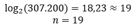
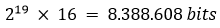
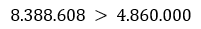
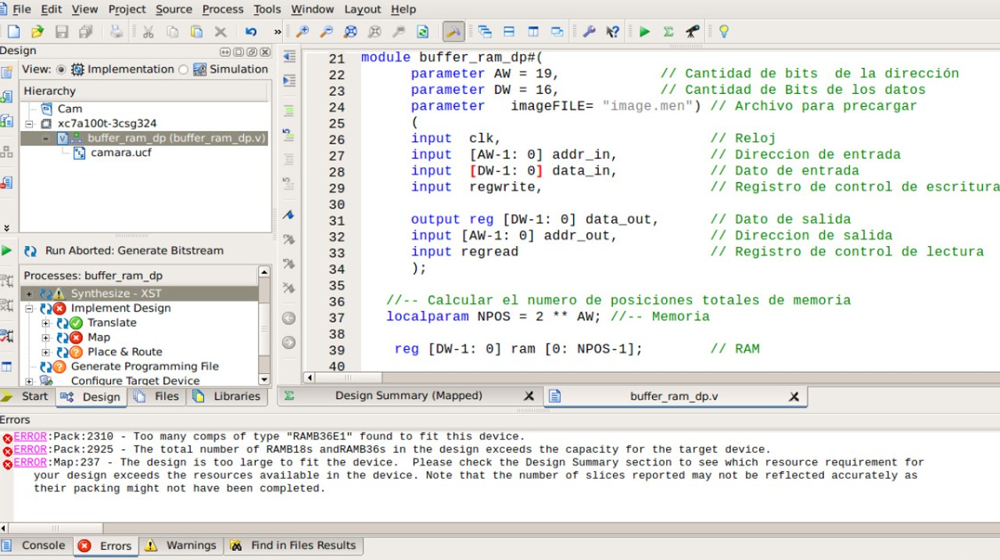
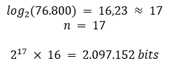
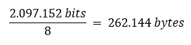
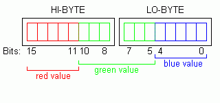
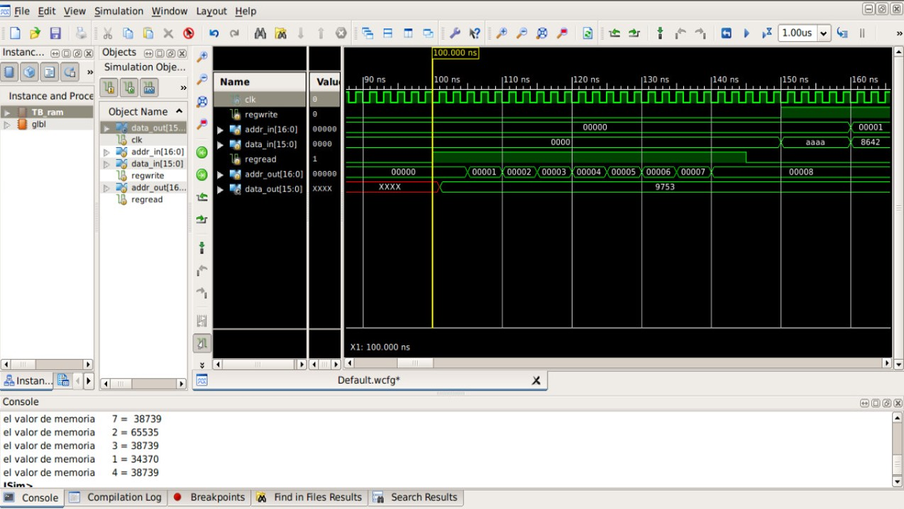
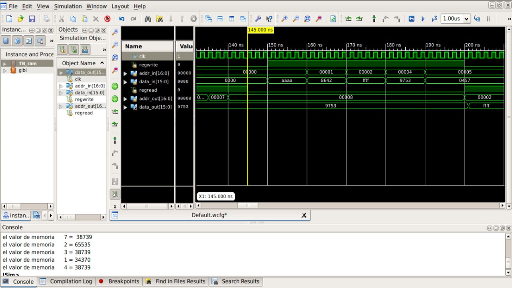
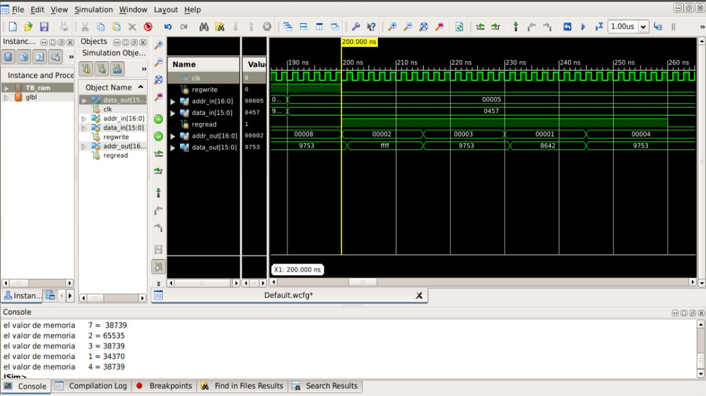

## GRUPO DE TRABAJO 05

### INTEGRANTES DEL GRUPO
#### Jhohan David Contreras Aragón		1007687796
#### Andrés Felipe Medina Medina 		1015464557
#### Mitchell Elizabeth Rodríguez Barreto	1032503089

### Pregunta 1:
¿Definir cuál es el tamaño máximo de buffer de memoria que puede crear?, se recomienda leer las especificaciones de la FPGA que está usando cada grupo. La respuesta se debe dar en bytes.

Para determinar el tamaño máximo del buffer de memoria que se puede crear con la FPGA, en este caso la Nexys 4 DDr, primero se revisó el datasheet y se encontró que el valor de bloque de memoria RAM en la FPGA es de 4.860.000 bits.

Para calcular el número de bits que va a ocupar la memoria se debe tener en cuenta el formato del pixel con el que se va a trabajar, ya que este define la cantidad de bits que necesita cada pixel para conformar la imagen final. Como se explicará en la siguiente pregunta, el formato escogido es el RGB 565, en donde cada pixel necesita 16 bits, es decir, cada pixel está conformado por 2 bytes. Por lo tanto, el tamaño de la RAM está definido de la siguiente manera:

En donde cada fila es un pixel, por ende la altura está definida por la cantidad de pixeles que hay en la imagen y la cantidad de columnas representa la cantidad de bits por pixel, en este caso 16.  

* Para una imagen de 640 x 480 pixeles
El número de posiciones en una memoria está dado por 2^n, en éste caso, como el número de pixeles a usar es de 640 x 480 = 307.200, se busca un exponente tal que 2 elevado a ese exponente sea mayor o igual a 307.000. Para encontrar el valor de _n_ se halla el logaritmo en base 2 de 307.200 y como el exponente debe ser entero, ya que es la altura de una matriz, se redondea el resultado al entero mayor más cercano. 

El tamaño en bits de la memoria RAM sería el número de posiciones por el ancho del registro:

Como se puede observar el número de bits sobrepasa el permitido por la tarjeta. 

Lo anterior también se puede observar en ISE, debido a que al hacer la síntesis muestra un error.

* Para una imagen de 320 x 240 pixeles.

Se decide recortar el tamaño de la imagen para que quepa en la FPGA, se escala por un factor de 2, por lo que la nueva imagen es ahora 1/4 del tamaño con respecto al tamaño anterior. Ahora el número de posiciones, o pixeles, totales es de 320 x 240 = 76.800. Se hace el mismo procedimiento y se encuentra que el exponente de 2 más cercano que almacena esta cantidad de pixeles es:  

Como se puede observar el tamaño en bits de la memoria RAM para una imagen de 320 x 240 pixeles ocuparía el 43,15 % de la memoria disponible en la FPGA, por lo tanto, se decide usar este tamaño. El tamaño en bytes sería de 262.144.

### Pregunta 2:
¿Cuál formato y tamaño de imagen de la cámara OV7670 que se ajusta mejor al tamaño de memoria calculado en la pregunta 1?. Para ello revisar la hoja de datos de la cámara OV7670. Revisar el datasheet.

Primero escogemos el formato del pixel a usar, dentro de las opciones disponibles estaba el RGB 555 y el RGB 565. Escogimos este último ya que la cámara bota un bus de datos de 8 bits, por lo que en dos buses podemos llenar un pixel y no se descarta un bit, como si lo tendriamos que hacer con el formato RGB 555. En este formato, el pixel está definido de esta manera

   * 5 bits para el color rojo
   * 6 bits para el verde
   * 5 bits para el azul.

En donde los primeros 5 bits más significativos del primer bus o Byte (High Byte) conforman el color rojo, y los 3 restantes junto con los 3 más significativos del segundo bus o byte (Low Byte) forman el color verde, dejando así los 5 menos significativos de este segundo bus para el color azul.

* Como se mencionó en la pregunta anterior, el tamaño de la imagen será la mitad del tamaño máximo, es decir, 320 x 240 (debido al espacio disponible en la FPGA).

### Pregunta 3:

¿Cuáles son los registros de configuración de la cámara OV7670 que permiten tener la configuración dada en la pregunta 2? Revisen los registros dados de la página 11 a la 26 del datasheet e indiquen la configuración para:

* Reestablecer todos los registros

Pin F2 RESET#: Limpiar todos los registros
0: Reset mode

12 -> COM7

Bits | Configuración
------------ | -------------
Bit[7] | 1: Reestablecer todos los registros a los valores predeterminados. SCCB Reestablecer registro
Bit[6] | Reservado
Bit[5] | Formato de salida – Selección CIF
Bit[4] | Formato de salida – Selección QVGA
Bit[3] | Formato de salida – Selección QCIF
Bit[2] | Formato de salida – Selección RGB
Bit[1] | 1: Habilitar barra de color 
Bit[0] | Formato de salida – Raw RGB

Página 13 del datasheet

* Habilitar el escalado

0D -> COM4

Bits | Configuración
------------ | -------------
Bit[7:6] | Reservado
Bit[5:4]  | 01: 1/2 ventana
Bit[3:0] | Reservado

Página 12 del datasheet

* Configurar el formato y el tamaño del pixel:

40 -> COM15

Bits | Configuración
------------ | -------------
Bit[7:6] | 11: Rango de salida: [00] to [FF] 
Bit[5:4] | 01: RGB 565
Bit[3:0] | Reservado

Página 18 del datasheet

* Habilitar el test de barra de colores:

42 -> COM17

Bits | Configuración
------------ | -------------
Bit[7:6] | 01: 1/2 mismo valor de COM4
Bit[5:4] | Reservado
Bit[3] 1: | Habilitar
Bit[2:0] | Reservado

Página 19 del datasheet

70 -> SCALING_XSC

Bits | Configuración
------------ | -------------
Bit[7] | 10: Patrón de prueba[0] (SCALING_XSC, SCALING_YSC)
Bit[6:0] | Factor de escala horizontal

Página 21 del datasheet

71 -> SCALING_YSC

Bits | Configuración
------------ | -------------
Bit[7] | 10: Patrón de prueba[1] (SCALING_XSC, SCALING_YSC)
Bit[6:0] | Factor de escala vertical

Página 22 del datasheet

### Simulación

Se realizó la simulación del archivo TB_ram para comprobar que la RAM funcione correctamente a los diferentes estímulos de lectura y escritura.

Primero se observa la lectura de los datos precargados en la RAM por medio del archivo imageFILE = "image.men".

Luego se puede notar la escritura de 5 datos diferentes.

Y finalmente la lectura de los datos añadidos anteriormente.

